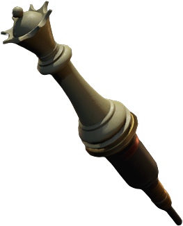

# Scénario A

## Conseils pour obtenir le rang S+

???+ tip "Vous pouvez arrêter le chronomètre en mettant le jeu en pause"

    <figure markdown="span">

    

    </figure>

    Le rang S+ doit être atteint dans un délai strictement limité (Normal : 03:30:00, Hardcore : 02:30:00). Vous devez minimiser le nombre d'actions afin de gagner du temps et éviter toute perte de secondes. Mettre le jeu en pause arrêtera le chronomètre, ce qui vous permettra de prendre le temps d'analyser les solutions des énigmes avant de les résoudre.

???+ warning "Tuez les ennemis sur les chemins les plus empruntés"

    <figure markdown="span">

    

    </figure>

    En mode Hardcore, si vous êtes attaqué deux fois, la partie est terminée. Soyez donc extrêmement vigilant. Prenez le temps de vaincre les ennemis sur les itinéraires les plus fréquentés, en agissant avec prudence. Ne vous précipitez pas et assurez-vous de maîtriser chaque rencontre.

???+ note "Ramassez toutes les munitions"

    <figure markdown="span">

    

    </figure>

    En mode Hardcore, les munitions sont rares, il est donc crucial d'en avoir constamment à portée de main, ou à défaut, de la poudre à canon. Lorsque votre inventaire est plein, privilégiez toujours les munitions et jetez les objets moins essentiels.

???+ warning "Quittez et rechargez la sauvegarde en cas de Game Over"

    <figure markdown="span">

    

    </figure>

    Si vous mourez pendant la partie, il est préférable de charger une sauvegarde plutôt que de continuer. Reprendre directement là où vous vous êtes arrêté rallonge considérablement votre temps de jeu.

???+ tip "L'utilisation du couteau infini est autorisée pour le rang S+"

    Bien que l'utilisation d'armes infinies ne soit pas autorisée pour obtenir le rang S+, vous pouvez tout de même obtenir ce rang en utilisant le couteau de combat infini. Cela permet de tuer facilement les zombies à terre et d'économiser des balles.

???+ abstract  "Points de sauvegarde recommandés" 

    - William Birkin 1ère forme avant le combat (pièce secrète sous la statue de la déesse)
    - William Birkin 2ème forme avant le combat (salle de surveillance des égouts après avoir résolu le puzzle d'échecs)
    - William Birkin 3ème forme avant le combat (laboratoire - zone Ouest après avoir obtenu l'échantillon du virus G)

    Pour obtenir la note S+, vous devez limiter le nombre de sauvegardes à 3 maximum. Les points recommandés ci-dessus concernent les combats contre les boss principaux avec William Birkin et les situations de mort instantanée.

## La station

| No. | Procédure          |
| :---------------: |:---------------| 
| 1 | Entrez dans la station-service par la porte principale | 
| 2 | Allez dans l'allée à côté de la personne assise en t-shirt bleu |   
| 3 | Continuez tout droit et regardez la cinématique |   
| 4 | Courez tout droit vers la clé immédiatement après la cinématique. Vous pouvez passer sans danger à travers le zombie  |   
| 5 | Quand vous avez la clé, regardez derrière vous et attendez que le zombie passe |   
| 6 | Courez vers la porte verrouillée et échappez aux zombies dans le magasin  |   
| 7 | Déclenchez la cinématique  |   
| 8 | Faites demi-tour immédiatement après la cinématique et courez |   

???+ warning  "4. Courez tout droit vers la clé immédiatement après la cinématique"

    Ignorez le zombie et foncez directement vers la clé. Dirigez-vous vers son côté pour le contourner en toute sécurité.

???+ warning "5. Lorsque vous obtenez la clé, regardez derrière vous et attendez que le zombie passe"

    <figure markdown="span">

    

    </figure>

    Après avoir obtenu la clé, attendez que le zombie passe devant l'étagère. Ainsi, vous n'aurez pas besoin de tirer et de gaspiller des munitions.

## Vers le RPD

| No. | Procédure          |
| :---------------: |:---------------| 
| 1 | Courez au poste de police | 
| 2 | En chemin, entrez dans la ruelle à gauche après la voiture de police |   
| 3 | Entrez par le portail et dirigez-vous vers le poste de police situé de l'autre côté |   
| 4 | Examinez immédiatement l'interrupteur situé à droite de l'entrée pour ouvrir le couloir Est du 1er étage  |   
| 5 | Passez par le volet situé juste à côté de l'interrupteur et rendez-vous dans la salle du gardien, à l'arrière |   
| 6 | Déclenchez la cinématique après avoir ouvert le volet dans la salle des gardes |   
| 7 | Après la cinématique, passez devant le zombie qui enfonce la porte  |   
| 8 | Il y aura deux zombies sur le chemin menant au hall principal, près de la salle de presse |   
| 9 | Tuez un zombie et courez vers le hall principal |   
| 10 | Récupérez un couteau de combat auprès de Marvin dans le hall principal |   

| No. | Lieu          | Objets |
| :---------------: |:---------------| :------------- |
| 4 | Hall principal |Spray de premiers secours   Ruban encreur |
| 6 | Toilettes |Spray de premiers secours |
| 9 | Salle de presse | Munitions (sur le cadavre au centre) |
| 9 | Petite pièce à gauche de la salle de presse | Munitions |

## Salle principale à l'appel de Marvin 

| No. | Procédure          |
| :---------------: |:---------------| 
| 1 |  Utilisez le couteau de combat pour vous rendre dans le couloir Ouest du 1er étage | 
| 2 | Rendez-vous dans la salle des opérations et mettez la planche de bois sur la fenêtre (la fenêtre avec les zombies près de la salle des opérations) |   
| 3 | Tuez les deux zombies lorsque vous sortez dans le couloir |   
| 4 |  Entrez dans le bureau Ouest et récupérez le chargeur rapide (serrure gauche : NED, serrure droite : MRG)  |   
| 5 | Récupérez la sacoche dans le coffre-fort (gauche 9, droite 15, gauche 7) |   
| 6 | Allez dans la chambre noire et fermez la fenêtre avec la planche de bois |   
| 7 | Montez les escaliers et tuez les zombies sur votre chemin |   
| 8 | Code pour récupérer les objets au deuxième étage : CAP |   
| 9 | Ouvrez le coffre-fort portable et récupérez l'objet dans la salle des coffres |   
| 10 | Organisez votre inventaire dans la chambre noire à l'aide de la boîte à objets |   
| 11 |  Récupérez la clé en forme de pique au 3e étage. Déverrouillez le casier à l'aide de la solution : DCM | 
| 12 | Traversez la réserve Ouest pour vous rendre à la bibliothèque |   
| 13 |  Lorsque vous arrivez à la bibliothèque, Marvin vous contactera par radio |   
| 14 | **Éliminez tous les ennemis dans la bibliothèque**  |   
| 15 | **Déplacez les étagères vers le milieu et alignez-les avec le trou dans le sol au-dessus** |   
| 16 | Entrez dans le salon et récupérez la médaille Licorne (poisson · scorpion · bouteille d'eau) |   
| 17 | Rendez-vous dans le hall principal avec la clé en forme de pique  |   
| 18 | Obtenez la médaille Lion (lion · feuille · oiseau) |   
| 19 | Déclenchez la cinématique en vous approchant de Marvin |   
| 20 | Après la cinématique, attachez les 2 médailles à la statue de la déesse au centre |   
| 21 | Déverrouillez la porte du bureau Ouest à l'aide de la clé de pique |   
| 22 | Rangez les objets dans la boîte du hall principal |   

| No. | Lieu          | Objets |
| :---------------: |:---------------| :------------- |
| 1 | Salle de réception | Herbe verte (près de l'entrée)   Munitions pour pistolet (sur la chaise) |
| 2 | Salle des opérations | Munitions pour pistolet  (juste après l'entrée) |
| 4 | Couloir devant le bureau Ouest | Munitions pour pistolet (derrière la salle des opérations)   Planche de bois (devant la chambre noire) |
| 5 | Bureau Ouest | Munitions pour pistolet (casier)   Poudre à canon (sur le bureau)   Sacoche (coffre-fort)   Chargeur rapide (bureau de Leon)|
| 6 | Chambre noire | Poudre à canon (casier)   Herbe rouge (arrière-salle)|
| 8 | 2e étage Ouest | Munitions pour pistolet (cadavre devant l'escalier)   Herbe rouge (devant la salle de douche)   Balles incendiaires (casier)   Balles incendiaires (casier avec clé)   Coffre-fort portable (sur l'étagère à côté du casier) |
| 9 | Salle des coffres |  Poudre à canon (102)   Munitions pour pistolet (109)   Balles incendiaires (208) |
| 11 | 3e étage Ouest | Munitions pour pistolet (sur la boîte devant l'escalier)   Munitions pour mitraillette (casier avec clé)   Clé en forme de pique |
| 12 | Réserve Ouest  | Poudre à canon (sur la boîte à côté de l'entrée)   Bois (à droite de l'entrée)   Munitions pour pistolet (étagère devant le C4)   Sacoche (sur le bureau devant le C4) |
| 13 | Bibliothèque  | Couteau de combat (cadavre à gauche sous l'escalier)   Livre rouge (bureau devant la porte pique)|
| 16 | Salon | Médaille licorne   Poudre à canon (bureau à droite de l'entrée) |
| 17 | Hall principal | Munition pour pistolet (au-dessus de la chaise à gauche en sortant de la bibliothèque)   Médaille lion |

???+ tip  "15. Déplacez les étagères vers le milieu"

    <figure markdown="span">

    

    </figure>

    Vous retournerez à la bibliothèque au milieu de l'histoire. Comme le Tyran vous traquera à ce moment-là, il vaut mieux déplacer les étagères à l'avance et tuer les zombies dans cette pièce pour vous faciliter la tâche.

## Vers les installations souterraines

| No. | Procédure          |
| :---------------: |:---------------| 
| 1 | Ouvrez la porte pique dans la salle d'attente (jetez la clé pique à ce stade)| 
| 2 | Récupérez la clé du casier à armes et le sceptre (joyau rouge) dans la salle d'art |   
| 3 | Empruntez la sortie de secours pour rejoindre le premier étage |   
| 4 | Utilisez le coupe boulon pour ouvrir le bureau côté Est |   
| 5 | Gardez les fenêtres fermées avec du bois |   
| 6 | Prenez le fusible et la valve dans le bureau côté Est |   
| 7 | Gardez les fenêtres du bureau Ouest fermées avec un cadre en bois |   
| 8 | Ouvrez le hall principal avec le fusible |   
| 9 | Organisez l'inventaire dans la boîte à objets |   
| 10 | Assurez-vous d'avoir la clé du casier à armes, le coupe boulon et la valve, puis dirigez-vous vers la salle des opérations |   
| 11 | Coupez la chaîne de la salle des opérations et récupérez le détonateur | 
| 12 | Laissez la clé et allez au casier à armes |   
| 13 | Récupérez le lance-grenades avec la clé du casier à armes |   
| 14 | Organisez les objets dans la boîte à objets  |   
| 15 | Utilisez la valve au 2e étage pour accéder au bureau STARS |   
| 16 | Tuez le Licker avec une grenade |   
| 17 | Récupérez la pile au bureau STARS |   
| 18 | Descendez le chemin et dirigez-vous vers la salle de stockage Ouest depuis la bibliothèque |   
| 19 | Fixez le détonateur au C4 |   
| 20 | Tuez le zombie suspendu au plafond |   
| 21 |  Après avoir installé le détonateur, l'étagère ne s'effondrera pas si vous vous échappez vers la bibliothèque |   
| 22 |  Obtenez la médaille (femme · arc · serpent) |   
| 23 | Mettre la médaille à la statue de la déesse dans le hall principal |   
| 24 |Allez dans la pièce secrète sous la statue de la déesse et continuez |   

| No. | Lieu          | Objets |
| :---------------: |:---------------| :------------- |
| 1 | Salle d'attente | Herbe verte (sur le bureau)   Chargeur étendu (coffre-fort) Remarque : vous n'avez pas besoin de le prendre pour l'instant, car il n'est pas encore nécessaire |
| 2 | Deuxième étage / Salle d'art | Planche de bois (près de la salle d'art)   Clé du casier à armes (sur le bureau d'accueil)   Sceptre (utilisez le livre rouge sur le bras gauche) |
| 3 | Sortie de secours | Herbe verte (devant la porte)   Coupe boulon (devant la porte du premier étage)   Munitions pour pistolet   Bois (sous les escaliers) |
| 6 | Bureau Est | Fusible   Valve (bureau dans la petite pièce)   Poudre à canon améliorée (blanche) (étagère dans la petite pièce)   Grenade flash (bureau à gauche de l'entrée)   Munitions pour pistolet (cadavre à gauche de l'entrée)   Poudre à canon (bureau à droite) |
| 11 | Salle des opérations | Détonateur (dessus du bureau)   Herbe verte (à gauche de l'entrée)   Grenade flash (à gauche de l'entrée) |
| 15 | Les douches (après la valve)  | Poudre à canon (casier arrière au fond) |
| 17 | Bureau STARS | Pile (bureau dans la petite pièce)   Herbe rouge (immédiatement après l'entrée)   Grenade flash (boîte avant gauche)   Balles incendiaires (bureau avant gauche)   Poudre à canon (blanche) (bureau gauche)   Spray de premiers secours (urgence à l'arrière gauche) |
| 24 |  Devant l'installation souterraine   | Balles incendiaires (étagère gauche) |

???+ tip  "13. Vous devez récupérer le lance-grenades"

    <figure markdown="span">

    

    </figure>

    Le lance-grenades est particulièrement efficace contre les Licker et William Birkin, donc si vous l'oubliez et que vous le ratez, vous perdrez beaucoup de temps. 

???+ warning  "20. Zombie au plafond"

    <figure markdown="span">

    

    </figure>

    Ce cadavre se met à bouger comme un zombie après l'explosion de la bombe C4. Il bloquera la voie d'évacuation vers la bibliothèque, vous devriez donc le neutraliser à l'avance.

## Installation souterraine vers le parking

| No. | Procédure          |
| :---------------: |:---------------| 
| 0 | (Facultatif) Vous pouvez sauvegarder pour la première fois | 
| 1 | Prenez l'ascenseur jusqu'à l'installation souterraine |   
| 2 | Récupérez la grenade à fragmentation dans les escaliers inférieurs |   
| 3 | Déclenchez la cinématique après le casier tombé |   
| 4 | Tuez le boss |   
| 5 | Montez à l'échelle après le combat avec William Birkin et suivez Sherry |   
| 6 | Tirez sur le levier pour créer un pont |   
| 7 | Organisez les objets dans la salle des opérations |   
| 8 | Montez l'échelle et allez au parking |   
| 9 | Examinez le terminal à la sortie du parking et déclenchez la cinématique |   

| No. | Lieu          | Objets |
| :---------------: |:---------------| :------------- |
| 1 | Escaliers souterrains | Grenade à fragmentation (sous l'escalier inférieur) |
| 4 | Salle des machines | Herbe verte (en haut à gauche de la carte)   Grenade à fragmentation (en haut à gauche et en bas à droite de la carte)   Herbe rouge (en bas à gauche)   Munitions pour pistolet (en bas à droite, en bas à gauche et en haut à gauche de la carte) |
| 4 | Salle des machines (étage) | Poudre à canon (montez à l'échelle et allez dans la pièce de gauche)   Herbe verte (montez à l'échelle et allez dans la pièce de gauche) |

???+ danger "4. William Birkin Première forme"

    <figure markdown="span">

    

    </figure>

    Vous affrontez votre premier boss. Utilisez des grenades pour lui infliger des dégâts. Son attaque de saisie peut causer une mort instantanée, alors ripostez avec un couteau ou une grenade.

???+ tip "4. Utilisation du couteau de combat"

    Ce boss peut être éliminé rapidement en l'attaquant de manière continue avec un couteau de combat.

## Parking vers le 1er équipement électronique 

| No. | Procédure          |
| :---------------: |:---------------| 
| 1 | Après la cinématique, rendez-vous au stand de tir | 
| 2 | Récupérer les objets dans le stand de tir |   
| 3 | Sortez par la porte du parking et utilisez la clé de la voiture. Jetez la clé après avoir déverrouillé le coffre de la voiture de police |   
| 4 | Rendez-vous au chenil et tuez 2 Lickers |   
| 5 | Obtenir la clé carreau dans la morgue |   
| 6 | Comme les zombies près de l'entrée sont plus coriaces, utilisez une grenade flash pour les neutraliser afin de pouvoir passer en toute sécurité |   
| 7 | Il y a un Licker au plafond sur le chemin du retour, battez-le si vous allez au stand de tir |   
| 8 | Si vous utilisez la clé carreau dans le stand de tir, vous pourrez la défausser plus tard |   
| 9 | Récupérez le JMPHp 3 dans le coffre de la voiture ouvert précédemment |   
| 10 | Rendez-vous à la salle de contrôle des ascenseurs | 
| 11 | Tirez le levier dans la salle de contrôle de l'ascenseur et montez dans l'ascenseur | 
| 12 | Organiser les objets dans le bureau du chef | 
| 13 | Laissez un pistolet dans la boîte à objets | 
| 14 | Obtenir le tableau en relief dans la salle de collection   Prendre la clé cœur à l'arrière du tableau | 
| 15 | Ouvrez la porte du bureau du chef | 
| 16 | Descendez les escaliers | 
| 17 | Ouvrez la salle d'interrogatoire | 
| 18 | Récupérez les balles et retournez au bureau du chef (ignorez l'ennemi) | 
| 19 | Montez les escaliers jusqu'à la salle de stockage Est | 
| 20 | Éliminez les deux zombies dans la salle de stockage Est | 
| 21 | Récupérez le grand engrenage dans la salle de stockage Est | 
| 22 | Récupérez une boîte de composants électroniques dans la salle de la porte cœur | 
| 23 | Organiser les objets dans le bureau du chef | 

| No. | Lieu          | Objets |
| :---------------: |:---------------| :------------- |
| 1 | Stand de tir | Clé de voiture (bureau juste après le stand de tir)   Balles incendiaires (étagère près de l'entrée du stand de tir) |
| 4 | Chenil | Poudre à canon renforcée (blanche) (panier juste devant l'entrée) |
| 5 | Morgue | Flash   Herbe Rouge   Clé Carreaux |
| 11 | Salle de contrôle de l'ascenseur | Herbe bleue (devant l'entrée)   Crosse d’épaule pour le Lance-Grenades (devant l'entrée et le casier)   Explosif amélioré (blanc) (derrière le bureau) |
| 12 | Bureau du chef | Herbe verte (couloir après l'ascenseur)   Munitions pour mitraillette (sur le bureau au centre) |
| 14 | Salle de collection  | Tableau en relief (sur le bureau) |
| 17 | Salle d'interrogatoire | Munitions pour pistolet (sur le bureau de gauche)   Boîte (insigne STARS) (étagère arrière) |
| 19 | Devant de la salle de stockage Est | Flash (casier côté balcon)   Munitions pour pistolet (casier de l'entrepôt) |
| 21 | Salle de stockage Est | Herbe bleue (étagères près de l'entrée)   Grande roue dentée (au-dessus de la boîte centrale)   Couteau de combat (pièce avec la clé cœur)   Boîte de composants électroniques (pièce avec la clé cœur) |

???+ warning "4. Tuez le Licker au chenil"

    <figure markdown="span">

    

    </figure>

    Vous devez traverser deux fois le chenil. Il faut donc éliminer le Licker dans cette pièce.

## Balcon jusqu'à Sherry

| No. | Procédure          |
| :---------------: |:---------------| 
| 1 | Montez les escaliers jusqu'au balcon | 
| 2 | Descendez de l'échelle |   
| 3 | Descendez les escaliers et tirez le levier |   
| 4 | Récupérez les deux herbes vertes |   
| 5 | Tirez sur le levier de la valve pour éteindre le feu |   
| 6 | Le Tyran apparaît lorsque vous passez de la porte vers l'hélicoptère |   
| 7 | Attirez le Tyran sur le balcon, esquivez-le et dirigez-vous vers le hall principal |   
| 8 | Récupérez le chargeur étendu JMP dans le coffre-fort de la salle d'attente (droite 6, gauche 2, droite 11) |   
| 9 | Gestion des objets dans le hall principal (assurez-vous d'avoir sur vous votre badge STARS et votre clé carreau) |   
| 10 | Convertir le badge STARS en clé USB | 
| 11 | Traversez la bibliothèque pour vous rendre à la buanderie | 
| 12 | Ouvrez la buanderie avec la clé carreau (jetez la clé) | 
| 13 | Obtenir le coffre-fort portable  | 
| 14 | Procurez-vous la mitraillette à l'aide de la clé USB au bureau STARS | 
| 15 | Rendez-vous à la salle des coffres (il est plus sûr d'y aller depuis le bureau Ouest) | 
| 16 | Battez le Licker dans le couloir | 
| 17 | Utiliser la clé de rechange dans la salle des coffres (203) Prendre la sacoche | 
| 18 | Ouvrez la salle des archives avec la clé cœur | 
| 19 | Récupérez l'outil | 
| 20 | Rendez-vous à la bibliothèque en passant par le hall principal | 
| 21 | Prenez le grand engrenage dans la boîte à objets | 
| 22 | Abaissez la bibliothèque à l'aide de l'outil | 
| 23 | Déplacez les dernières bibliothèques | 
| 24 | Passez par-dessus la bibliothèque à l'aide de l'échelle et rendez-vous à la tour de l'horloge | 
| 25 | Insérez le grand engrenage à droite | 
| 26 | Récupérez le grand engrenage et montez les escaliers | 
| 27 | Récupérez le petit engrenage à l'étage supérieur et remplacez-le par le grand engrenage | 
| 28 | Placez le petit engrenage devant les escaliers | 
| 29 | Récupérez la boîte de composants électroniques | 
| 30 | Traversez la salle de stockage Est pour vous rendre au bureau du chef | 
| 31 | Résolvez l'énigme du tableau électrique dans la salle de collection | 
| 32 | Après avoir examiné la carte, passez à la partie avec Sherry | 

| No. | Lieu          | Objets |
| :---------------: |:---------------| :------------- |
| 1 | Balcon | Herbe bleue (sur la table devant)   Munitions pour pistolet (sur le banc près de l'hélicoptère)   Herbe verte (au bout de l'escalier) |
| 6 | Après balcon | Herbe rouge (dès que vous franchissez la porte) |
| 8 | Salle d'attente | Chargeur étendu (coffre-fort) |
| 13 | Buanderie | Poudre à canon améliorée (blanche)   Coffre-fort portable (au-dessus de la machine à laver) |
| 19 | Salle des archives | Outil   Grenade   Poudre à canon |

## De Sherry jusqu'aux égouts

| No. | Procédure          |
| :---------------: |:---------------| 
| 1 | La partie avec Sherry commence | 
| 2 | Retournez immédiatement en arrière et ouvrez la peluche |   
| 3 | Prenez un bloc dans la peluche |   
| 4 | Utilisez les blocs dans le puzzle |   
| 5 | Résolvez le puzzle pour obtenir des ciseaux |   
| 6 | Utilisez les ciseaux sur le mur |   
| 7 | Descendez les escaliers et vérifiez les clés dans la salle du directeur |   
| 8 | Échappez au chef de la police |   
| 9 | Cachez-vous dans la chambre d'enfant près de l'étagère à serviettes, puis cachez-vous sous le bureau |   
| 10 | Prenez la clé   Rendez-vous dans le bureau du directeur et déclenchez la cinématique | 
| 11 | Vous contrôlez de nouveau Claire | 
| 12 | Organisez les objets dans le bureau du chef | 
| 13 | Ouvrez la sortie du parking avec la carte  | 
| 14 | Esquivez le Tyran dans le parking | 
| 15 | Approchez-vous du grillage avec deux zombies | 
| 16 | Franchissez la porte après la destruction, ce qui attire les zombies et le Tyran | 
| 17 | Descendez la rue et sortez des escaliers | 
| 18 | Laissez le premier chien derrière le grillage | 
| 19 | Tuez le chien sur la voiture banche, puis le chien sur le chemin | 
| 20 | Rendez-vous sur le terrain de basket | 
| 21 | Tuez les trois chiens à travers le grillage | 
| 22 | Dans le bus, mettez à terre le zombie pour passer | 
| 23 | Tuez le dernier chien, puis accédez à l'orphelina | 
| 24 | Lorsque vous arrivez à l'orphelinat, récupérez les objets au deuxième étage | 
| 25 | Descendez l'échelle qui mène du bureau du chef de la police aux égouts | 
| 26 | Après avoir rejoint Sherry, échappez au Tyran jusqu'à l'ascenseur |

| No. | Lieu          | Objets |
| :---------------: |:---------------| :------------- |
| 20 | Terrain de basket | Munitions pour mitraillette   Herbe verte |
| 22 | Bus | Grenade |
| 24 | Orphelinat | Munitions pour mitraillette (salle de bain à l'arrière de la chambre d'enfant)   Spray de premiers secours (salle de bain à l'arrière de la chambre d'enfant) |

## Égouts jusqu'à l'acquisition du fusil électrique 

| No. | Procédure          |
| :---------------: |:---------------| 
| 1 | Récupérez l'objet dans le bureau après la cinématique | 
| 2 | Descendez depuis le couloir près du bureau |   
| 3 | Empruntez le chemin qui mène à la salle de contrôle   Vous pouvez ignorer les zombies dans cette salle|   
| 4 | Ouvrez le casier (SZF) |   
| 5 | Sortez de la salle de contrôle par le trou situé à gauche de la salle |   
| 6 | Vous pouvez changer votre pistolet pour le SLS 60 dans la salle de surveillance |   
| 7 | Descendez le pont du bassin de traitement   Récupérez l'outil sur la plate-forme du téléphérique |   
| 8 | Récupérez le cadre renforcé dans le coffre-fort (gauche 2, droite 12, gauche 8) |   
| 9 |  Descendez les escaliers à droite du bassin de traitement |   
| 10 | Éliminez 2 zombies |   
| 11 | Descendez les escaliers et à gauche ouvrez la porte à l'aide de l'outil |   
| 12 | Descendez l'échelle vers le canal inférieur (vous n'avez pas besoin de prendre la clé pour l'instant) |   
| 13 | Dirigez-vous vers la salle de stockage tout en évitant le G adulte |   
| 14 | Prenez la Reine dans la salle de stockage |   
| 15 | Récupérez le fusil électrique après avoir obtenu le Roi |   
| 16 | Récupérez le Roi et la Reine, et retournez à la salle de surveillance |   
| 17 | Passez à côté du G adulte tout en le blessant avec le fusil électrique    Ignorez le G adulte avant l'échelle |   
| 18 | Lorsque vous atteignez la salle de surveillance, installez les pièces |   
| 19 | Organisation des objets dans la salle de surveillance |   

| No. | Lieu          | Objets |
| :---------------: |:---------------| :------------- |
| 1 | Bureau | Munitions renforcées pour SLS 60 (à côté de la machine à écrire) |
| 3 | Salle de contrôle |  Munitions incendiaires (cadavre)   Munitions pour mitraillette (casier) |
| 7 | Bassin de traitement  | Cadre de renfort (coffre-fort)   Herbe bleue (zombies à l'arrière du coffre-fort)   Herbe rouge (plateforme du téléphérique)   Herbe verte (sous les escaliers) |
| 12 | Canal inférieur | Herbe verte (à côté du premier cadavre en descendant l'échelle) |
| 15 |  Salle des marchandises |  Herbe rouge (étagères à côté de l'entrée)   Munitions incendiaires (pièce ouverte avec le Roi) |

???+ tip "14. Solution pour obtenir le fusil électrique"

    <figure markdown="span">

    { width="200" }

    </figure>

    Vous aurez besoin d’au moins 4 emplacements libres dans votre inventaire pour résoudre l’énigme et prendre l’arme qui occupe deux cases.

    * Prenez la Reine sur le panneau électrique
    * Placez cette prise Reine sur le second panneau électrique
    * Récupérez le Roi à l'étage et sautez
    * Placez le Roi sur le panneau électrique qui contrôle l’accès à la petite pièce du fond
    * Récupérez le fusil électrique
    * Ouvrez ensuite la seconde porte depuis l’intérieur, retournez prendre le Roi, puis la Reine
    * Replacez la Reine sur son panneau électrique d’origine
    * Placez le Roi sur le panneau électrique au fond à gauche
    * Allez récupérer la Reine depuis l’intérieur 
    * Repartez avec le Roi

???+ warning "12. Passer à travers G adulte"

    <figure markdown="span">

    

    </figure>

    Le G adulte apparaît sur le chemin du retour et bloque le passage. Si vous utilisez un tir électrique, vous ne pourrez pas bouger pendant que l'arme se recharge. Il est donc préférable de vous faufiler sur le côté.

## Fusil électrique vers William Birkin deuxième forme 

| No. | Procédure          |
| :---------------: |:---------------| 
| 1 | Descendez les escaliers dans la bassin de traitement et tirez le levier de droite vers les égouts   Vous pouvez ignorer l'adulte G qui sort sur le côté | 
| 2 | Ouvrez la porte et montez dans l'ascenseur de service |   
| 3 | Éliminez les zombies dans la salle de travail |   
| 4 | Récupérez la Tour |   
| 5 | Retournez dans la salle de surveillance |   
| 6 | Résolvez le casse-tête des prises dans la salle de surveillance |   
| 7 | Organisez vos objets (comme il s'agit d'un combat contre un boss, il est recommandé d'utiliser la mitraillette et des grenades) |   
| 8 | Sauvegardez (deuxième fois) |   
| 9 | Résolvez le casse-tête dans la salle d'alimentation principale (On, On, Off, On) |   
| 10 | En sortant de la salle, William Birkin apparaît |   
| 11 |  Évitez l'attaque depuis le plafond   Brisez le volet et passez à côté de William Birkin |   
| 12 | Détruisez William Birkin à l'aide de la grue |   
| 13 | Après l'avoir vaincu, ouvrez la porte du broyeur à déchets et sauvez Sherry |   
| 14 | Dirigez-vous vers le téléphérique menant au laboratoire |   

| No. | Lieu          | Objets |
| :---------------: |:---------------| :------------- |
| 1 | Égouts | Grenade à fragmentation (dans la direction opposée au levier)   Herbe bleue (porte d'entrée) |
| 9 | Salle d'alimentation principale |  Herbe bleue (à côté de la benne à ordures)   Herbe verte (avant la benne à ordures)   Herbe rouge (à côté de l'alimentation électrique principale) |
| 7 | Bassin de traitement  | Cadre de renfort (coffre-fort)   Herbe bleue (zombies à l'arrière du coffre-fort)   Herbe rouge (plateforme du téléphérique)   Herbe verte (sous les escaliers) |
| 12 | Station de traitement des eaux  | Munitions pour pistolet (côté grue)   Flash (côté grue)  Couteau de combat (côté grue) |

???+ tip "11. La zone près du puzzle interrupteur est sûre"

    <figure markdown="span">

    

    </figure>

    L'attaque de Birkin depuis le plafond ne vous touche pas lorsque vous vous tenez à côté du panneau de commande. Attendez que l'attaque cesse afin de ne pas subir de dégâts inutiles.

???+ tip "11. Attendez à côté de la porte"

    <figure markdown="span">

    

    </figure>

    Une fois que Birkin rugit, déplacez-vous sur le côté de la porte. Vous pouvez vous faufiler sur le côté.

## Laboratoire jusqu'à la dispersion chimique

| No. | Procédure          |
| :---------------: |:---------------| 
| 1 | Descendez le chemin et rendez-vous à la salle des gardes | 
| 2 | Organisez les objets dans la zone d'accueil |   
| 3 | Rendez-vous à la cafétéria par la porte à côté de l'entrée |   
| 4 | Ignorez les zombies dans la cafétéria et grimpez à l'échelle |   
| 5 | Empruntez la porte en sortant de la cuisine    Tuez le zombie à l'endroit où vous avez ouvert la porte |   
| 6 | Combinez les composants électroniques et le bracelet |   
| 7 | Dirigez-vous vers le hall principal |   
| 8 | Ouvrez le passage vers la zone Est |   
| 9 | Organisez les objets dans le hall (conservez beaucoup de munitions incendiaires) |   
| 10 | Traversez la salle de conférence et rendez-vous à la salle de contrôle de la serre |   
| 11 | Brûlez les ennemis Ivy sur votre chemin avec des munitions incendiaires |   
| 12 | Obtenez la cartouche de dispersion au centre de contrôle de la serre |   
| 13 | Entrez le code de cryptage    Laboratoire d'analyse (2067)   Échelle (3123)  |   
| 14 | Dirigez vous vers le laboratoire d'analyse |  
| 15 | Résolvez l'énigme des médicaments : milieu, gauche, droite, milieu, gauche, droite, milieu, gauche |  
| 16 | Allez à l'échelle depuis la trappe ouverte |  
| 17 | Tuez les zombies (3 ennemis) lorsque vous arrivez dans le salon   Deux Lickers apparaissent au fur et à mesure que vous avancez, vous pouvez les ignorer pour l'instant|  
| 18 | Montez les escaliers et éliminez tous les zombies sur la route |  
| 19 | Prenez le modulateur et retournez dans le salon |  
| 20 | Tuez les Lickers dans le salon |  
| 21 | Le modulateur réglé sur MURF permet de rétablir l'électricité |  
| 22 | Refroidissez l'herbicide dans le laboratoire à basse température |  
| 23 | Organisez vos objets dans la salle des serveurs |  
| 24 | Dirigez-vous vers la salle de contrôle de la serre   Brûler le lierre avec des balles incendiaires |  
| 25 | Après avoir pulvérisé l'agent chimique, combiner les composants électroniques avec le bracelet |  
| 26 |  Ouvrir le passage vers la zone Ouest dans le hall principal |  

| No. | Lieu          | Objets |
| :---------------: |:---------------| :------------- |
| 3 | Cafeteria  |  Cartouche d'aiguille (étagère de gauche immédiatement) |
| 5 | Cuisine |  Poudre à canon (grande) (à gauche de l'endroit où vous êtes descendu)   Couteau de combat (à gauche de la cuisine) |
| 6 | Salle de sieste  | Composant électronique (main dépassant vers la droite)   Condensateur haute tension (casier gauche)   Munitions incendiaires (étagère gauche) |
| 9 | Hall principal | poudre à canon (bureau devant la boîte à objets) |
| 10 | Centre de contrôle de la serre | Flash (bureau central) |
| 14 | Laboratoire d'analyse |  Poudre à canon (bureau central) |
| 16 | Serre | Herbe rouge (descendez l'escalier à gauche)   Herbe bleue (porte d'entrée) |
| 20 | Salon |  Poudre à canon (en bas de l'échelle et à gauche au bout)   Munitions incendiaires |
| 23 | Salle des serveurs |  Poudre à canon améliorée (blanche) (étagère gauche)   Munitions incendiaires (boîte d'objets à gauche) |

???+ danger "11. Méfiez-vous de l'attaque mortelle instantanée des Ivy"
    
    <figure markdown="span">

    

    </figure>

    Les Ivy, qui apparaîssent à partir d'ici, peuvent vous infliger une attaque mortelle instantanée lorsqu'elles vous attrapre. Si vous mourez, vous serez renvoyé au point de sauvegarde, ce qui vous fera perdre du temps. Assurez-vous toujours d'avoir une arme pour riposter, comme un couteau, ou tuez-les avec des balles incendiaires.

## Laboratoire Ouest à William Birkin 3eme forme

| No. | Procédure          |
| :---------------: |:---------------| 
| 1 | Dirigez-vous vers la zone Ouest | 
| 2 | Rétablissez l'électricité à l'aide du modulateur de signal OSS    Organisation des objets|   
| 3 | Continuez pour récupérer les médicaments antiviraux |   
| 4 | Gestion des objets avant le combat contre le boss   Mitraillette / Lance-grenades requis   Grenades flash   Balles renforcées SLS |   
| 5 | Sauvegardez pour la troisième fois |   
| 6 | Après la cinématique, combattez la troisième forme de William Birkin |   
| 7 | Retournez à la salle des gardes après le combat |   

| No. | Lieu          | Objets |
| :---------------: |:---------------| :------------- |
| 2 | Laboratoire biologique  |   Grenade à fragmentation (cadavre sur le chemin menant au laboratoire)   Herbe bleue (sortie latérale) |
| 3 | Laboratoire de niveau P-4 | Herbe rouge (casier)   Poudre améliorée (blanche) (sur le bureau)   Poudre à canon (grande) (Étagère de droite) |
| 6 | Récipient de culture adulte |  Spray de premiers secours (côté gauche du laboratoire)   Balle renforcée pour SLS 60 (côté droit du laboratoire)   Flash (côté droit du laboratoire, côté ascenseur)   Cartouche à aiguille (bas de la carte, à gauche)   Grenade à fragmentation |

???+ tip "6. Visez les yeux dans les genoux lorsque le combat commence"

    <figure markdown="span">

    

    </figure>

    Lorsque la bataille commence, visez les petits yeux situés au niveau des genoux avec votre mitraillette. Ce sera une excellente occasion, car il est difficile de viser pendant que vous êtes en mouvement.
    
???+ tip "6. Utilisez des balles acides pour annuler ces attaques"

    <figure markdown="span">

    

    </figure>

    Vous pouvez annuler les attaques en le frappant avec une balle acide. S'il est touché par une balle acide, vous pourrez vous déplacer sans danger de l'autre côté. Préparez une dizaine de balles acides à l'avance.

???+ tip "6. Tirez des balles renforcées SLS lorsque la poitrine s'ouvre"

    <figure markdown="span">

    

    </figure>

    La balle renforcée SLS est l'équivalent du Magnum pour Claire. Vous pouvez infliger d'importants dégâts en tirant dans les globes oculaires situés dans la poitrine, qui constituent un point faible. Sachez que vous ne pouvez l'utiliser que si vous obtenez le cadre renforcé dans les égouts.

???+ tip "6. Continuez à viser la poitrine pendant la deuxième moitié du combat"

    <figure markdown="span">

    

    </figure>

    Lorsque Birkin subit des dégâts supérieurs à un certain seuil, son comportement change et ses points faibles, à savoir ses globes oculaires, sont toujours exposés. En gardant vos distances, vous pouvez le vaincre en tirant sur ses globes oculaires.

## Évasion du laboratoire vers la fin

| No. | Procédure          |
| :---------------: |:---------------| 
| 1 | Accompagnez Sherry jusqu'au hall principal | 
| 2 | Activez l'ascenseur situé au centre du hall principal |   
| 3 | Descendez de l'ascenseur et continuez sur le chemin |   
| 4 | Organiser vos objets pour la dernière fois |   
| 5 | Lorsque vous êtes prêt, descendez avec le petit ascenseur   Ignorez l'Ivy sur la route et courez jusqu'à la porte |   
| 6 | Descendez l'échelle et trouvez la porte   Combattez les Ivy jusqu'à ce que Sherry ouvre la porte   Si vous avez des balles incendiaires, utilisez-les ici |   
| 7 | Lorsque la porte s'ouvre, suivez le chemin   Vous pouvez vaincre les zombies qui s'y trouvent |   
| 8 | Récupérez une prise double dans le train   Utilisez la prise double dans la pièce à côté du train   Récupérez le minigun |   
| 9 | Après la cinématique, le combat contre la 4ème forme de Birkin commence |   
| 10 | Le temps de jeu est déterminé à la fin du jeu |   

???+ tip "4. Gérez votre inventaire avant le combat"
   
    <figure markdown="span">

    

    </figure>

    Voici la dernière boite, les objets ne pourront plus être remplacés avant la fin. Ne prenez que les objets nécessaires, comme les grenades à fragmentation pour le boss. Ranger le fusil électrique et les autres objets inutiles. ** Gardez 2 emplacements d'objet pour le minigun et la prise double.**

???+ tip "9. Infligez des dégâts importants avec les grenades à fragmentation"    

    <figure markdown="span">

    

    </figure>

    La grenade à fragmentation est également puissante pour cette 4ème forme. Elle est recommandée car elle est facile à utiliser lorsqu'elle est lancée à l'arrêt, par exemple après une course.

???+ tip "9. Utilisez le minigun avec les grenades à fragmentation"

    <figure markdown="span">

    

    </figure>

    Si vous utilisez les grenades à fragmentation, vous pouvez vaincre le boss en visant uniquement son point faible avec le minigun. Si vous tirez ailleurs que sur ses points faibles, vous allez épuiser vos munitions, alors soyez patient et visez avec précision.
   

## Cartes

???+ info "Commissariat, 1er étage"

    <figure markdown="span">

    

    </figure>

???+ info "Commissariat, 2eme étage"

    <figure markdown="span">

    

    </figure>

???+ info "Commissariat, 3eme étage (+4)"

    <figure markdown="span">

    

    </figure>

???+ info "Installation souterraine"

    <figure markdown="span">

    

    </figure>

???+ info "Commissariat, parking"

    <figure markdown="span">

    

    </figure>

???+ info "Orphelinat"

    <figure markdown="span">

    

    </figure>

???+ info "Les rues derrière le commissariat"
    
    <figure markdown="span">

    { width="600" }

    </figure>

???+ info "Égouts supérieurs"
    
    <figure markdown="span">

    { width="600" }

    </figure>

???+ info "Égouts"
    
    <figure markdown="span">

    

    </figure>

???+ info "Égouts inférieurs"
    
    <figure markdown="span">

    

    </figure>

???+ info "Laboratoire"
    
    <figure markdown="span">

    

    </figure>