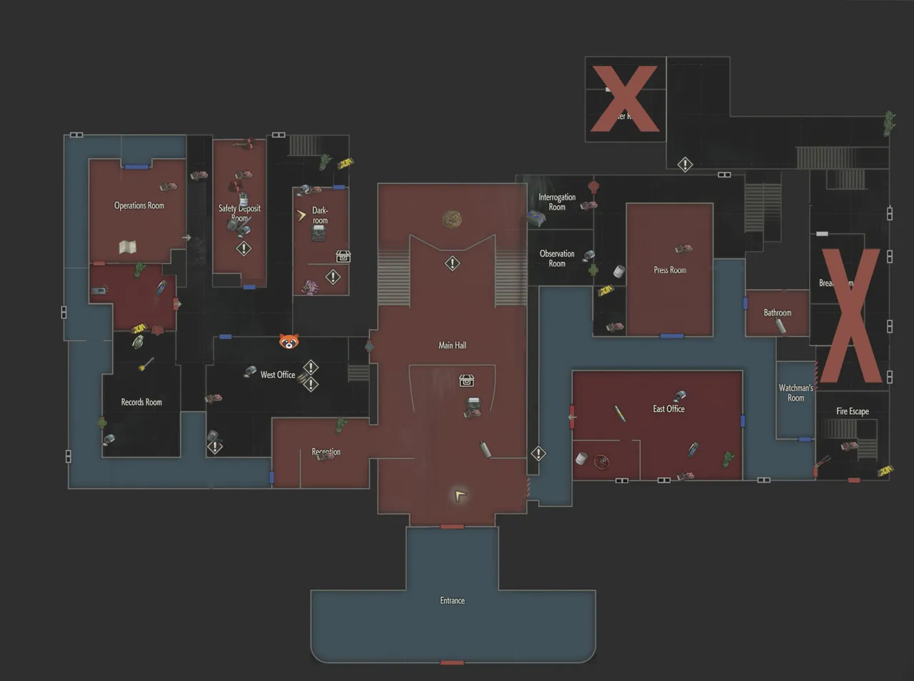
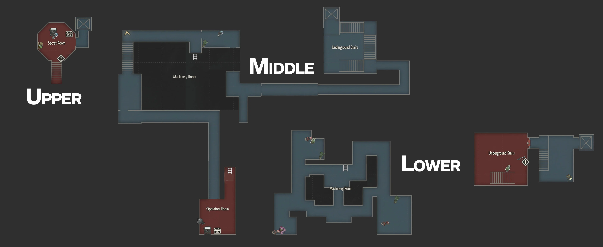
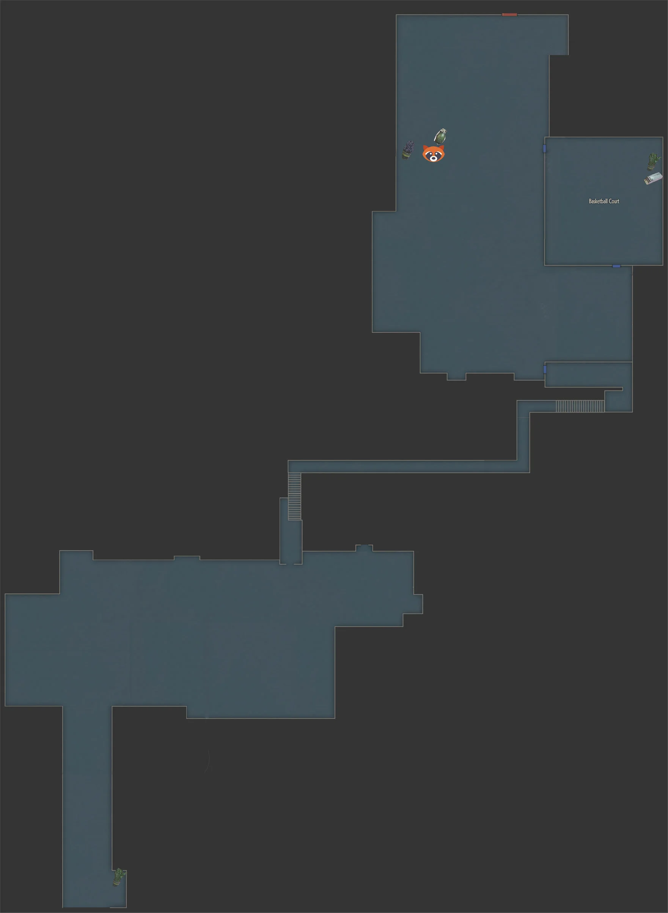
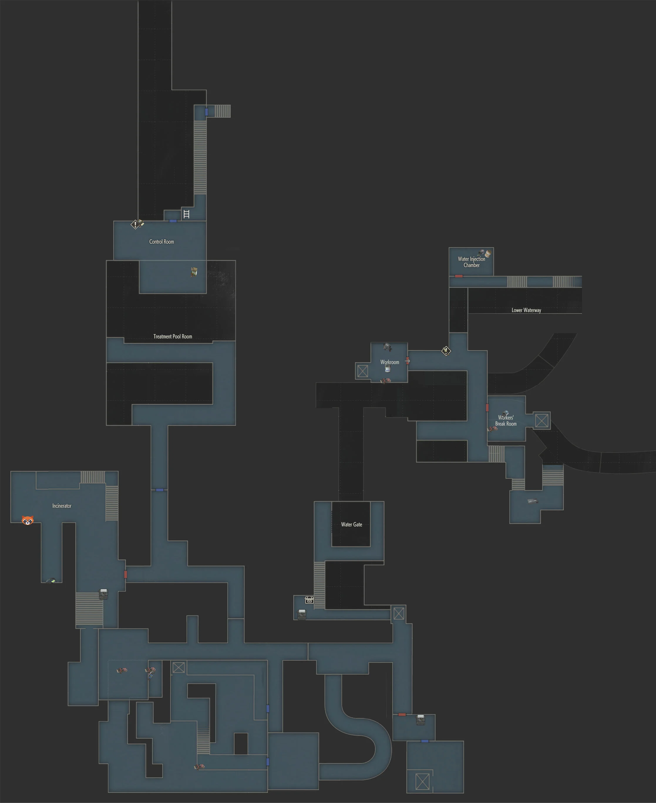
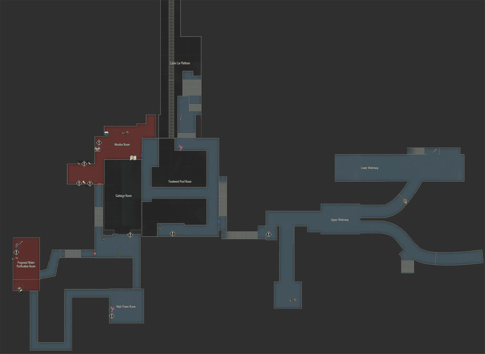
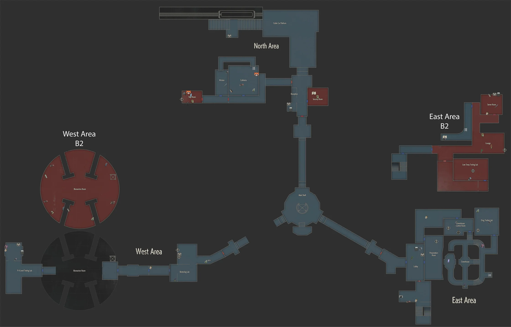

## Cartes

???+ info "[Claire A] Commissariat, 1er étage"

    <figure markdown="span">

    

    </figure>

???+ info "[Claire A] Commissariat, 2eme étage"

    <figure markdown="span">

    

    </figure>

???+ info "[Claire A] Commissariat, 3eme étage (+4)"

    <figure markdown="span">

    

    </figure>

???+ info "Installation souterraine"

    <figure markdown="span">

    

    </figure>

???+ info "[Claire A] Commissariat, parking"

    <figure markdown="span">

    

    </figure>

???+ info "[Claire A] Orphelinat"

    <figure markdown="span">

    

    </figure>

???+ info "[Claire A] Les rues derrière le commissariat"
    
    <figure markdown="span">

    { width="600" }

    </figure>

???+ info "Égouts supérieurs"
    
    <figure markdown="span">

    { width="600" }

    </figure>

???+ info "Égouts"
    
    <figure markdown="span">

    

    </figure>

???+ info "Égouts inférieurs"
    
    <figure markdown="span">

    

    </figure>

???+ info "Laboratoire"
    
    <figure markdown="span">

    

    </figure>