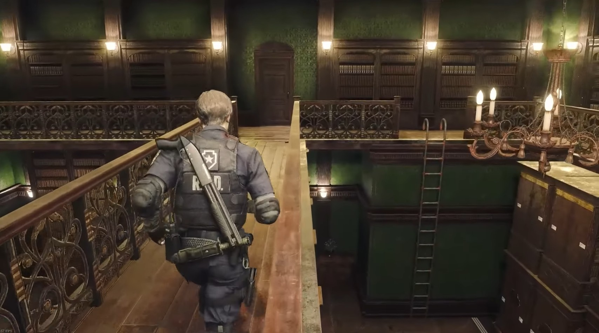
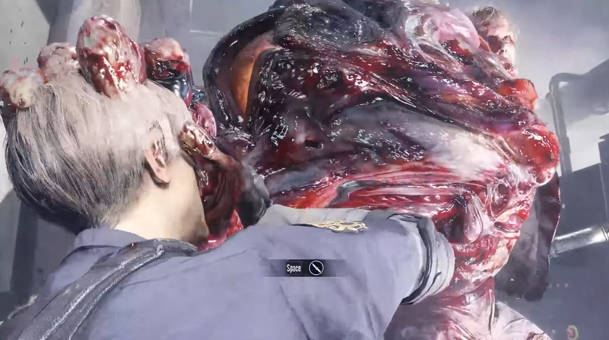
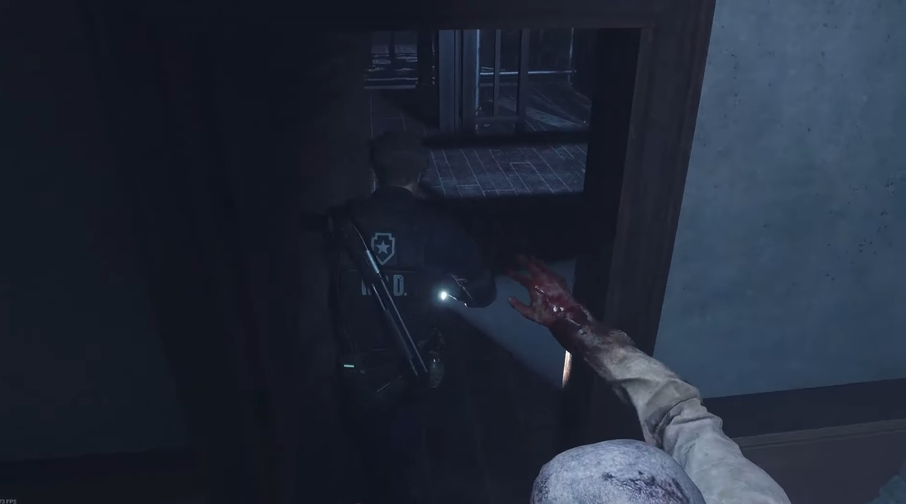
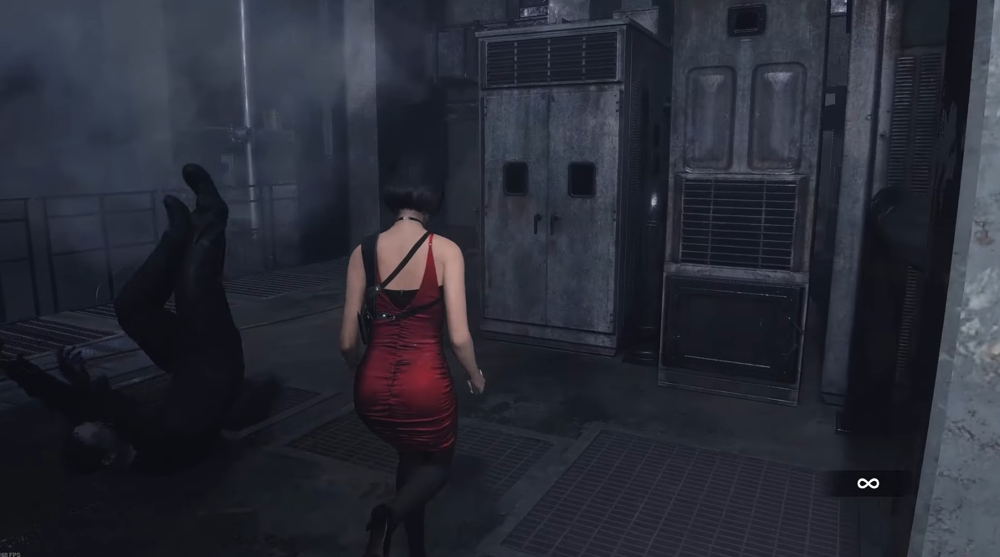
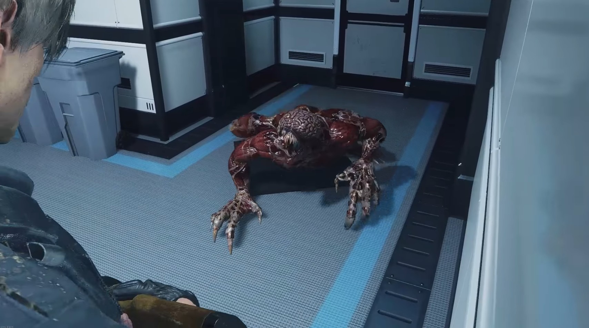

# Leon | Scénario B

## Commissariat [1/3] 

   
| No. | Procédure          |
| :---------------: |:---------------| 
| 1 | Traversez le cimetière   + *Ruban encreur (sur le banc, au fond à gauche)* | 
| 2 | Suivez le chemin et récupérez le coupe-boulons   *+ Herbe rouge (juste après avoir monté les escaliers)*   + *Herbe bleue (sur la droite juste avant le muret)*   *+ coupe-boulons (dans la brouette)* |   
| 3 | Après la cinématique, rebroussez chemin jusqu'à la porte en bas des escaliers   Ouvrez-la avec le coupe-boulons |   
| 4 | Récupérez tous les objets dans la salle des gardes   *+ Grenade (sur le radiateur)*   *+ Pistolet M19 (sur la table)*   *+ Munitions pour pistolet x10 (sur les boîtes en carton à côté des casiers)*   *+ Clé de la cour (sur la porte du casier ouvert)* |   
| 5 | Après vous êtes changé, déposez dans le coffre :   - Mathilda   - Ruban encreur   - Herbe R+B    |   
| 6 | Retournez au grillage, en tirant dans le genou du zombie dans les escaliers et en lançant une genade dans la meute au niveau du muret |   
| 7 | Ouvrez la grille et jetez la clé |   
| 8 | Montez dans le couloir Est, via l'escalier de secours   *+  Munitions pour pistolet x10 (sur les barils sous l'escalier)*   *+ Planches en bois (au sol, à côté de la clôture)* |   
| 9 | Traversez jusqu'à la salle d'art   *+ Planches en bois (à côté du mur dans le coin nord-ouest du passage)* |   
| 10 | Prenez seulement la carte pour le dépôt d'armes   *+ Carte pour le dépôt d'armes (sur la petite table avec la lampe de lecture verte)* |

| No. | Procédure          |
| :---------------: |:---------------| 
| 11 | Retournez vers la porte menant à l'escalier de secours |
| **12** | Éliminez les deux zombies enflammés |
| 13 | Rendez-vous au bureau Est au 1er étage via l'escalier de secours |
| 14 | Récupérez les objets   *+ Flash (sur un bureau vers l'entrée)*   *+ Munitions pour pistolet (sur le corps du policier)*   *+ Valve (dans le petit bureau)*   *+ Poudre à canon de haute qualité (jaune) (dans le petit bureau)*|
| 15 | Rendez-vous dans la salle de presse en faisant une étape dans la petite salle d'archivage   *+ Planches en bois (petite salle d'archivage)*   *+ Munitions pour pistolet x5 (petite salle d'archivage)*   *+  Munitions pour pistolet x5 (sur le corps dans la salle de presse)*| 
| **16** | Rendez-vous dans la salle de pause via le volet de la petite salle de garde   Allumez la lumière en rentrant | 
| 17 | Organisez vos objets dans la salle de pause    *- Valve*   *- Flash*   *- Poudre à canon de haute qualité (jaune)* | 
| 18 | Récupérez les objets dans la salle   *+ Herbe bleue (sur la table)*   *+ Munitions pour pistolet x8 (dans le casier de droite)*   *+  Poudre à canon de haute qualité (jaune) (dans le casier de gauche)*   *+ Fusible (sur une chaise dans l'autre salle)*| 
| 19 | Réorganisez vos objets dans la salle de pause   *- Poudre à canon de haute qualité (jaune)*   *- Herbe bleue* | 
| 20 | Sortez de la salle et récupérez les objets   *+ Cartouches de fusil x2 (sur les étagères métalliques)*   *+ Couteau de combat (planté dans le mur à côté du boîtier à fusibles)*| 

???+ danger "12. Éliminez les deux zombies enflammés"

    <figure markdown="span">

    { width="416" }

    </figure>

    Prenez votre temps en ciblant la tête, attendez que le réticule soit stable pour tirer et reculez quand nécéssaire.

???+ warning "16. Attention en sortant de la salle de presse"

    <figure markdown="span">

    { width="416" }

    </figure>

    Le zombie peut vous attaquer, courez dans la direction opposée le temps qu'il finisse sa charge, puis brisez lui les genoux pour passer.

| No. | Procédure          |
| :---------------: |:---------------| 
| 21 | Réorganisez vos objets dans la salle de pause   *- Cartouches de fusil x2*   *- Couteau de combat* | 
| **22** | Dirigez vous maintenant vers le hall principal   *+ Spray de premiers secours (dans les toilettes, celles du milieu)*| 
| 23 | Utilisez le fusible pour ouvrir le volet menant au hall principal | 

???+ warning "22. L'homme kebab"

    <figure markdown="span">

    { width="416" }

    </figure>

    Attention à l'homme kebab, tuez-le pour ne pas qu'il pose problème pour la suite.

## Commissariat [2/3] 

| No. | Procédure          |
| :---------------: |:---------------| 
| 1 | Longez l'entrée du hall principal et traversez la réception   *+ Munitions pour pistolet x6 (réception)* | 
| **2** | Traversez le couloir en disposant des planches de bois sur les fenêtres : les premières sur la deuxième fenêtre, tout droit en rentrant vers le corps du policier; ensuite, sur la fenêtre après avoir passé la porte ouverte; enfin, les dernières sur la fenêtre au fond du couloir |   
| 3 | Dans la salle des opérations, utilisez le coupe-boulons sur la porte du fond   *+ Munitions pour pistolet x4 (à gauche directement en rentrant dans la salle)*   *+ Carte (sur le tableau)*| 
| 4 | Jetez maintenant le coupe-boulons et récupérez les objets dans la salle de stockage   *+ Détonateur*   *+ Herbe verte*   *+ Flash*| 
| **5** | Sortez par la porte verouillée et éliminez les deux zombies   *+ Munitions pour pistolet x3 (sur le corp, au fond à gauche en arrivant)*| 
| 6 | Dans le bureau Ouest, récupérez la sacoche dans le coffre-fort (gauche 9, droite 15, gauche 7)   *+ Munitions pour pistolet x2 (à l'intérieur du casier)*   *+ Poudre à canon* | 
| 7 | Récupérez le chargeur étendu (serrure gauche : NED, serrure droite : MRG) | 
| 8 | Ressortez et ouvrez le coffre dans la salles des coffres   *+  Munitions pour pistolet x5 (109)*| 
| 9 | Dirigez-vous maintenant vers la chambre noire |
| 10 | Éliminez les deux zombies au niveau des escaliers   *+ Herbe verte*| 

???+ danger "2. Ne courez pas"

    <figure markdown="span">

    { width="416" }

    </figure>

    Il est possible qu'un Licker se trouve dans ce couloir. Comme il est aveugle, marchez tout le long du couloir et ne courez pas afin d'éviter d'attirer son attention.

???+ tip "5. Visez la tête"

    <figure markdown="span">

    { width="416" }

    </figure>

    Même chose que pour les zombies enflammés, afin d'augmenter votre chance de faire un coup critique, attendez bien que le réticule soit stable pour tirer, puis reculez quand nécéssaire.

| No. | Procédure          |
| :---------------: |:---------------| 
| 11 | Entrez dans la chambre noire et allumez la lumière    *+ Herbe rouge*   Combinez HV + HR |  
| 12 | Organisez vos objets   *- Herbe verte + rouge*   *- Chargeur étendu*   *- Herbe verte*   *- Flash*   *- Poudre à canon*   *- Spray de premiers secours* | 
| 13 | Fouillez les casiers   *+ Poudre à canon*   *+ Rubans encreurs x3* | 
| 14 | Organisez vos objets   *- Poudre à canon*  *- Rubans encreurs x3*   *+ Munitions pour fusil x2*| 
| 15 | Sortez et éliminez le dernier zombie | 
| 16 | Récupérez le fusil à pompe et les balles dans la salle des coffres   Pensez à recharger le fusil | 
| 17 | Montez les escaliers   *+ Munitions pour pistolet x3 (dans le coin au deuxième étage)*   *+ Herbe rouge (deuxième étage)* |
| 18 | Tuez le zombie en haut des escaliers   *+ Munitions pour pistolet x4*   *+ Clé pique* |
| 19 | Dans la salle de stockage Ouest, tuez le zombie au plafond   *+ Poudre à canon (en rentrant sur le petit meuble)*   *+ Munitions pour pistolet x4 (sur l'étagère près de l'endroit à faire exploser)*| 
| 20 | Déposez le détonateur |

## Commissariat [3/3] 

| No. | Procédure          |
| :---------------: |:---------------| 
| **1** | Allez maintenant dans la bibliothèque et tuez le zombie qui se balade, ainsi que celui assis devant la porte pique   *+ Couteau de combat (sur le corps en bas des escaliers)*| 
| 2 | Déplacez les bibliothèques : celle de droite une fois sur la gauche; celles de gauche une fois sur la droite   *+ Munitions pour pistolet x6 (derrière la bibliothèque la plus à gauche)* | 
| 3 | Passez la porte en bas des escaliers et récupérez le médaillon (jumeaux - balance - petit ver)   *+ Carte*| 
| 4 | Retournez dans le hall en passant par la bibliothèque   *+ Munitions de pistolet x3 (au fond à droite en sortant de la bibliothèque)*| 
| 5 | Récuperez le médaillon Lion (couronne - torche - oiseau) | 
| 6 | Descendez et ouvrez la porte pique | 
| 7 | Tuez les deux zombies avec une balle de fusil dans la tête chacun, ajoutez des balles de pistolet si nécéssaire | 
| **8** | Disposez les médaillons | 
| 9 | Récupérez l'herbe verte dans la réception et combinez-la avec votre herbe rouge | 
| 10 | Allez dans la salle d'attente au premier étage, tuez le zombie de la même manière que les autres | 

???+ warning "1. N'empruntez pas l'échelle"

    <figure markdown="span">

    { width="416" }

    </figure>

    Si vous empruntez l'échelle de la bibliothèque, vous allez attirer le zombie qui mange.

???+ tip "8. Soignez-vous"

    <figure markdown="span">

    { width="416" }

    </figure>

    Si vous vous êtes fait toucher, un spray premiers secours est disposé à l'entrée du commissariat.

| No. | Procédure          |
| :---------------: |:---------------| 
| 11 | Utilisez la clé pique pour pouvoir la jeter et récupérez le silencieux dans le coffre-fort (droite 6, gauche 2, droite 11)   *+ Herbe verte*|
| 12 | Retournez dans le bureau Ouest via le hall principal | 
| 13 | Dirigez-vous dans la chambre noire | 
| 14 | Organisez vos objets   *- Herbe verte*   *- Silencieux*   *- Herbe verte + rouge*   *- Poudre à canon*   *- Couteau de combat*   *+ Valve* |
| 15 | Montez au premier étage au niveau des douches | 
| 16 | Dévérouillez le casier (CAP), mais n'ouvrez pas le dernier casier tout à gauche   *+ Cartouches de fusil x3 (dans le casier)*   *+ Cartouches de fusil x3 (dans le casier verouillé)*| 
| 17 | Utilisez la valve   *+ Poudre à canon (dans le casier le plus à gauche des vestiaires suivants)*| 
| 18 | Empruntez le couloir pour entrer dans le bureau des S.T.A.R.S   *+ Cartouches de fusil x2 (dans le couloir sur le banc)*   *+ Pile (sur le bureau individuel)*   *+ Herbe rouge*   *+ Poudre à canon de haute qualité (jaune)*   *+ Spray de premiers secours*   *+ Flash*   *+ Cartouches de fusil x2*   *+ Munitions pour pistolet x6*| 
| **19** | Allez combiner la pile avec le détonateur | 
| 20 | Ouvrez la porte de la bibliothèque le temps de l'explosion, pour éviter que l'étagère ne chute | 

???+ warning "19. Rebroussez chemin"

    Repartez sur la droite, de là d'où vous venez. Vous allez être poursuivi par le Tyran. En partant dans ce sens vous éviterez de tomber dessus.

| No. | Procédure          |
| :---------------: |:---------------| 
| 21 | Récupérez le dernier médaillon (bélier - harpe - oiseau) | 
| 22 | Rendez-vous dans le hall principal via la bibliothèque pour déposer le dernier médaillon |
| 23 | Empruntez le passage secret   *+ Cartouches de fusil x2*   *+ Ruban encreur*|
| 24 | Organisez vos objets   *- TOUT*   *+ Couteau de combat x2*   *+ Flash*   *+ Ruban encreur x1* |
| 25 | Effectuez votre première sauvegarde |

## Passage souterrain

| No. | Procédure          |
| :---------------: |:---------------| 
| 1 | Empruntez l'ascenseur et dirigez-vous vers le boss   *+ Grenade à fragmentation (sous les escaliers)* | 
| 2 | Déclenchez la cinématique en déplaçant le casier |
| **3** | Vaincre William Birkin |
| 4 | Fouillez la pièce   *+ Herbe verte (sur un baril d'eau dans la partie sud-est de la pièce)*   *+ Munitions pour pistolet x8 (au-dessus des caisses dans la partie sud-est de la pièce)*   *+ Herbe rouge (au-dessus des palettes en bois dans la partie sud-ouest de la pièce)*   *+ Munitions pour pistolet x7 (au-dessus d'un baril dans la partie sud-ouest de la pièce)*   *+ Munitions pour pistolet x7 (sur les machines recouvertes d'une bâche dans la partie nord-ouest de la pièce)*   *+ Grenade à fragmentation (sur les machines dans la partie nord-ouest de la pièce)*   *+ Herbe verte (sur les petites boîtes en plastique bleu situées à côté du panneau de commande dans la partie nord-ouest de la pièce)*|
| 5 | Montez l'échelle pour aller activer le levier   *+ Poudre à canon (dans un casier, juste en haut à droite de l'échelle)*   *+ Herbe verte* (dans un coin, juste en haut à droite de l'échelle)|
| 6 | Traversez le pont et organisez votre inventaire   *- TOUT, excepté les munitions pour pistolet*   *+ M19*   *+ Cartouches de fusil*   *+ Fusil à pompe*|
| 7 | Accédez au terminal du parking pour déclencher la cinématique | 

???+ tip "3. Vaincre William Birkin"

    <figure markdown="span">

    { width="416" }

    </figure>

    Dès la fin de la cinématique, utilisez votre grenade à fragmentation. Ensuite, frappez-le avec le couteau qui est en meilleur état. Essayez de le toucher deux fois par coup, une fois dans le corps et l'autre dans le bras. À la fin de son animation, utilisez votre grenade flash et continuez.

???+ danger "3. Il va probablement vous attraper"

    <figure markdown="span">

    { width="416" }

    </figure>

    Dès que votre couteau est à moitié usé, échangez-le avec le couteau qui est en moins bon état. De cette manière, si Birkin vous attrape, vous pourrez le contrer (ce qui vous fera perdre votre couteau nul) et continuer à lui mettre des coups avec le couteau restant en meilleur état.

## Parking

| No. | Procédure          |
| :---------------: |:---------------| 
| 1 | Rendez-vous au stand de tir   *+ Clé de la voiture (dans la boite jaune)*   *+ Cartouches de fusil x4 (sur le petit chariot situé dans le coin sud-est de la zone de cible)* | 
| 2 | Retournez dans le parking et ouvrez le coffre de la voiture avec la clé, jetez-la ensuite   *+ Crosse Matilda*|
| 3 | Descendez dans le passage souterrain et ouvrez le coffre à objets   *- Crosse Matilda*|
| 4 | Retournez dans le parking et empruntez la porte menant à la prison   *+ Carte*   *+ Munitions pour pistolet x4*|
| 5 | En rentrant dans la prison, tuez le zombie allongé avec une cartouche de fusil |
| 6 | Continuez votre route pour déclencher la cinématique |
| 7 | Après la cinématique, récupérez la manivelle |
| 8 | Faite demi-tour et rendez-vous au chenil   *+ Herbe bleue (devant la porte du chenil, dans l'impasse)* |
| 9 | Tuez les trois chiens dans les cages   *+ Poudre à canon de haute qualité (jaune) (à droite de la porte d'entrée)* |
| 10 | Continuez jusqu'à rentrer dans la morgue |

| No. | Procédure          |
| :---------------: |:---------------| 
| 11 | Récupérez les objets   *+ Herbe rouge (deuxième porte sur la droite)*   *+ Flash (dernière porte sur la droite)* | 
| 12 | Retournez dans le couloir et utilisez votre manivelle pour ouvrir le volet |
| 13 | Empruntez la porte pour arriver dans la salle du générateur   *+ Herbe verte (derière la porte en rentrant) (pensez à combinez vos trois herbes)*   *Poudre à canon*   *Composant électronique (boite orange)* |
| 14 | Résolvez l'énigme de l'alimentation (off, on, on, off) |
| 15 | Faite demi-tour, tuez le chien derrière le grillage |
| 16 | En sortant de la pièce, tuez également le chien |
| **17** | Tuez un autre chien dans le couloir à l'aide du fusil à pompe |
| 18 | Tuez également le chien dans le chenil avec l'aide du fusil |
| 19 | Alez dans la salle de pose, via la porte ouverte grâce à l'alimentation |
| 20 | Organisez vos objets   *- Poudre à canon de haute qualité (jaune)*   *- Composant électronique*   *- Poudre à canon*   *- Flash*   *- Herbe V+R+B* |

???+ tip "17. Anticipez le chien"

    <figure markdown="span">

    { width="416" }

    </figure>

    Visez le haut de la grille au sol pour anticipez le chien qui arrive en courant. Dès qu'il est dans votre viseur, tirez.

## Retour au commissariat [1/2]

| No. | Procédure          |
| :---------------: |:---------------| 
| 1 | Dirigez-vous vers la salle des gardes, tuez les trois zombies avec le fusil à pompe | 
| 2 | Montez les escaliers de secours | 
| 3 | Ouvrez le volet après la salle d'art, puis jetez la manivelle |
| 4 | Récupérez les planches de bois en haut des escaliers   *+ Planches de bois* | 
| 5 | Descendez tous les escaliers et utilisez les planches sur la fenêtre   *+ Poudre à canon de haute qualité (jaune) (casier au bout du couloir)* | 
| 6 | Remontez tous les escaliers   *+ Flash*   *+ Munitions pour pistolet x4 (dans le casier)* | 
| 7 | Tuez les deux zombies de la salle de stockage Est   *+ Herbe bleue*   *+ Grand engrenage*   *+ Cartouches de fusil x4*| 
| 8 | Faites demi-tour et tempruntez maintenant la porte vers la terrasse   *+ Herbe bleue*| 
| 9 | Descendez l'échelle   *+ Munitions pour pistolet x4 (sur le banc vers les flammes)*| 
| 10 | Descendez les escaliers et combinez les herbes   *+ Herbes vertes x2*| 

| No. | Procédure          |
| :---------------: |:---------------| 
| 11 | Activez le levier et tuez les deux zombies avec le fusil à pompe | 
| 12 | Organisez vos objets   *- Herbes B+V x2*   *- Flash*   *- Poudre à canon de haute qualité (jaune)*| 
| 13 | Prenez la clé trèfle et repartez   *+ clé trèfle* | 
| 14 | Remontez les escaliers et activez le levier du toit | 
| 15 | Entrez dans le couloir   *+ Herbe rouge* | 
| **16** | Esquivez le Tyran |
| 17 | Dirigez-vous vers le hall via la salle d'attente   *+ Herbe verte (combinez avec la rouge)* | 
| 18 | Empruntez le couloir Ouest, au niveau de la réception | 
| 19 | **Marchez pour ne pas attirer le licker.**  | 
| 20 | Ouvrez la salle des archives avec la clé trèfle | 

???+ danger "16. Esquivez le Tyran"

    <figure markdown="span">

    { width="416" }

    </figure>

    Si vous le sentez, vous pouvez juste esquivez son coup en fonçant sur lui au moment où il frappe. Sinon, faites demi-tour et contournez le sur le toit.

| No. | Procédure          |
| :---------------: |:---------------| 
| 21 | Récupérez les objets   *+ Grenade à fragmentation*   *+ Outil*| 
| **22** | Attendez le Tyran | 
| 23 | Repartez dans le couloir et marchez jusqu'à la réception | 
| 24 | Courez jusqu'à la bibliothèque | 
| 25 | Utilisez l'outil sur la bibliothèque coincée. Puis déplacez celle la plus à gauche sur la droite | 
| 26 | Montez l'échelle, et prenez la porte en passant sur les bibliothèques | 

???+ danger "22. Esquivez le Tyran, encore"

    <figure markdown="span">

    { width="416" }

    </figure>

    Attendez le Tyran dans la salle des archives, et esquivez ses coups grâce à l'angle de l'étagère. De cette manière, vous gagnerez du temps car il frappera dans le vide.

## Retour au commissariat [2/2]

| No. | Procédure          |
| :---------------: |:---------------| 
| **1** | Dirigez-vous vers la salle de l'horloge | 
| 2 | Utilisez le grand engrenage, **n'oubliez pas de le récupérer** | 
| 3 | Rendez-vous dans le couloir du fond pour récupérer l'objet   *+ Poudre à canon (grande quantité)*|
| 4 | Montez les escaliers   *+ Petit engrenage*   *- Herbe V+R (Si vous n'avez pas assez de place)*| 
| 5 | Utilisez le grand engrenage | 
| 6 | Redescendez et utilisez le petit engrenage | 
| 7 | Récupérez le composant électronique | 
| 8 | Ouvrez prudement la porte, puis dirigez-vous vers la salle de stockage Est | 
| 9 | Continuez votre chemin pour redescendre par les escaliers de secours | 
| 10 | Organisez votre inventaire dans la salle de pause   *- clé trèfle*   *- Herbe verte*   *- Grenade à fragmentation*   *- Poudre à canon (grande quantité)*   *+ Composant électronique*   *+ Flash*| 

???+ warning "1. Collez-vous au mur de droite"

    <figure markdown="span">

    { width="416" }

    </figure>

    Pour ne pas vous faire attraper par le zombie, longez le mur sur la droite jusqu'à la porte.

## Accès aux égouts

| No. | Procédure          |
| :---------------: |:---------------| 
| 1 | Retournez maintenant au parking | 
| **2** | Traversez-le pour atteindre la prison | 
| **3** | Résolvez le puzzle électronique | 
| 4 | Récupérez les objets dans la cellule   *+ Spray de premiers secours*   *+ Carte d'accès du parking* | 
| 5 | Rebroussez chemin et activez le levier | 
| 6 | Esquivez le Tyran (en le faisant frapper le vide) | 
| 7 | Avancez et utilisez une grenade flash sur les zombies (si vous vous faites toucher, utilisez le spray de premiers secours) | 
| 8 | Déclenchez la cinématique dans le parking | 
| 9 | Ouvrez la porte du parking grâce au terminal   *+ Herbe verte (sur la droite derrière la porte)* | 
| 10 | Suivez Ada jusqu'à l'armurerie | 

???+ warning "2. Chiens méchants"

    <figure markdown="span">

    { width="416" }

    </figure>

    Serpentez du mieux que vous pouvez pour esquivez les chiens. C'est ok de se faire toucher.

???+ tip "3. Solution du puzzle électronique"

    <figure markdown="span">

    { width="416" }

    </figure>

    Voici comment doivent-être disposées les pieces du puzzle.

| No. | Procédure          |
| :---------------: |:---------------| 
| 11 | Récupérez les objets dans l'armurerie   *+ Amélioration pour fusil à pompe*   *+ Grenade à fragmentation*   *+ Munitions pour pistolet x3*  | 
| 12 | Déclenchez la cinématique | 
| 13 | Suivez Ada jusqu'aux égouts   *+ Munitions pour pistolet x4 (au bout d'un des tunnels)* | 
| 14 | Organisez vos objets   *- Herbe verte*   *- Grenade* | 
| 15 | Passez la grille et continuez votre chemin | 
| 16 | Sautez dans les égouts pour déclencher la cinématique | 
| **17** | Survivez à l'alligator | 
| 18 | Tirez sur le tuyau jaune   *+ Grenade à fragmentation* | 
| 19 | Continuez jusqu'à débuter la partie avec Ada | 

???+ tip "17. Esquiver l'alligator"

    <figure markdown="span">

    { width="416" }

    </figure>

    Collez-vous sur la gauche jusqu'à sa première morsure. Dès qu'il mord, collez-vous sur la droite. Il va ensuite mordre deux fois, après cela, collez-vous de nouveau à gauche.

## Ada

| No. | Procédure          |
| :---------------: |:---------------| 
| 1 | Utilisez l'échelle pour déclencher la cinématique | 
| 2 | Intéragissez ensuite avec le mur de droite pour activer le circuit caché. Puis, avec le ventilateur pour le briser | 
| 3 | Montez l'echelle | 
| 4 | Au bout du tunel, intéragissez avec le circuit en bas à droite du ventilateur, puis le ventilateur lui-même, et enfin le circuit en bas à gauche du ventilateur | 
| 5 | Descendez dans la pièce et passez la porte | 
| 6 | Descendez les escaliers   *+ Munitions pour pistolet x12* | 
| 7 | Évitez le zombie en passant entre le contenaire rouge et les caisses | 
| **8** | Continuez votre chemin, passez la lumière rouge | 
| 9 | Scannez le circuit à l'endroit où la barrière jaune joint le mur | 
| 10 | Faites demi-tour et activez l'ascenseur, tirer dans les jambes des zombies qui vous bloquent le chemin pour passer | 

???+ warning "8. Zombie venant du ciel"

    <figure markdown="span">

    { width="416" }

    </figure>

    Restez bien sur la droite pour ne pas vous faire écraser par le zombie.

| No. | Procédure          |
| :---------------: |:---------------| 
| 11 | Dès que vous êtes devant la porte métalique, activez le circuit au loin à droite | 
| 12 | Activez le levier | 
| 13 | Pendant que la porte s'ouvre, activez le circuit juste au-dessus | 
| 14 | Dirigez-vous vers le ventilateur en intéragissant avec lui également | 
| 15 | Passez la grille et montez les escaliers plus loin | 
| 16 | Activez le levier et rendez-vous dans l'incinérateur | 
| **17** | Corrigez les circuits pour dévérouiller la porte | 
| 18 | Continuez en dévérouillant la porte avec le bracelet pour terminer la partie d'Ada |  

???+ tip "17. Sortir de l'incinérateur"

    <figure markdown="span">

    { width="416" }

    </figure>

    Ordre d'activation : mur de gauche en bas à gauche, porte en haut à gauche, mur de gauche au milieu, porte en haut à droite, mur de droite au milieu, porte en haut au milieu.

## Égouts [1/3]

| No. | Procédure          |
| :---------------: |:---------------| 
| 1 | Faites demi-tour et utilisez l'ascenceur | 
| 2 | Organisez vos objets   *- Grenade à fragmentation* | 
| 3 | Sautez dans les égouts | 
| 4 | Prenez le tunel de gauche   *+ Cartouches de fusil x2* | 
| 5 | Faites demi-tour et prenez le tunel de droite | 
| 6 | Montez les escaliers et tuez le zombie à l'aide du fusil | 
| 7 | Passez la passerelle, étourdisez le zombie pour passer et descendez les escaliers   *+ Couteau de combat (en bas des escaliers)*| 
| 9 | Laissez-vous glisser directement sur la droite   *+ Herbe bleue (en bas, devant la porte bleue)*   *+ Poudre à canon de haute qualité (jaune) (sur la gauche avant les deux tunels)*| 
| **10** | Passez le G adulte | 

???+ tip "10. Esquiver le G adulte"

    <figure markdown="span">

    { width="416" }

    </figure>

    Restez à une distance convenable et tirer lui dessus. Dès que vous avez tirer, courez en longeant le mur de gauche.

| No. | Procédure          |
| :---------------: |:---------------| 
| 11 | Montez l'échelle et passez la porte   *+ Cartouches de fusil x2 (au fond à gauche de la pièce)* | 
| 12 | Descendez dans le trou | 
| 13 | Récupérez les objets   *+ Rubans encreurs x2*   *+ Carte* | 
| 14 | Organisez vos objets   *- Herbe bleue*   *- Poudre à canon de haute qualité (jaune)*   *- Ruban encreur x1*   *- Couteau de combat*| 
| 15 | **Réalisez votre deuxième sauvegarde** | 
| 16 | Sortez et activez le pont | 
| 17 | Dirigez-vous vers le funiculaire ​​  *+ Herbe rouge*   *+ Barre en T* | 
| **18** | Allez maintenant ouvrir le coffre de l'autre côté de la pièce (-> 2,<- 12,-> 8)   *+ Herbe bleue* | 
| 19 | Ouvrez la porte et descendez les escaliers .   Tuez les deux zombies qui vous accueilent ainsi que celui allongé à l'aide du fusil à pompe ​​  *+ Herbe verte*   *+ Grenade (dans l'eau)* |
| 20 | Retournez à la salle de sauvegarde | 

???+ warning "18. Ne pas réveiller le zombie qui dort"

    <figure markdown="span">

    { width="416" }

    </figure>

    Restez bien sur la droite pour ne pas réveiller le zombie.

## Égouts [2/3]

| No. | Procédure          |
| :---------------: |:---------------| 
| 1 | Organisez vos objets   *- Herbe V+B+R*   *- Cartouches pour fusil*   *- Fusil à pompe*   *+ Couteau de combat* | 
| 2 | Retournez en bas des escaliers, et ouvrez la porte sur la gauche grâce à la barre en T | 
| 3 | Descendez l'échelle, **ne prenez pas la clé**  | 
| 4 | Récupérez l'objet et retounez vous pour montez sur le tas de vase   *+ Herbe verte* | 
| 5 | Tirez sur l'adulte G et esquivez-le sur la droite | 
| 6 | Esquivez l'autre adulte G après qu'il ait frapper | 
| 7 | Continuez pour récupérez la Reine   *+ Herbe rouge (sur des étagères)*|  
| 8 | Placez la Reine en-dessous des escaliers   *+ Herbe bleue (dans des cartons)*|  
| 9 | Récupérez le Roi en haut des escaliers et sautez |  
| 10 | Repassez la porte sous les escaliers et utilisez le Roi au fond   *+ Lance-flammes* |  

| No. | Procédure          |
| :---------------: |:---------------| 
| 11 | Reprennez le Roi et étourdissez les zombies pour ressortir |  
| 12 | Posez la Reine sur son emplacement d'origine | 
| 13 | Posez le Roi | 
| 14 | Récupérez la Reine puis le Roi | 
| 15 | Sortez de la pièce et esquivez le zombie puis l'adulte G | 
| 16 | Longez le mur de gauche | 
| **17** | Esquivez le dernier adulte G | 
| 18 | Remontez l'échelle et retournez dans la salle de sauvegarde | 

???+ warning "17. Accéder facilement à l'échelle"

    <figure markdown="span">

    { width="416" }

    </figure>

    Le dernier adulte G est facilement esquivable. Attendez qu'il vous charge et dès qu'il essaye de vous attraper, foncez.

## Égouts [3/3]

| No. | Procédure          |
| :---------------: |:---------------| 
| 1 | Organisez vos objets   *- Lance-flammes*   *+ Cartouches de fusil*   *+ fusil à pompe* | 
| 2 | Redescendez les escaliers et activez le levier sur la droite | 
| 3 | Longez sur la gauche jusqu'à la porte bleue et utilisez la barre en T | 
| 4 | Prenez l'ascenceur   *+ Cartouches de fusil x3 (avant l'ascenseur)* |
| 5 | Courez vers la porte   *+ Munitions pour pistolet x5* |
| 6 | Récupérez la Tour |
| 7 | Retournez prendre l'ascenseur en esquivant le zombie grâce à la table |
| 8 | Attendez que l'adulte G plonge pour repartir à la salle de sauvegarde |
| **9** | Résolvez le puzzle avec les pièces d'échecs |
| 10 | Organisez vos objets   *- M19*   *- Fusil à pompe*   *- Cartouches de fusil*   *- Barre en T*   *+ Matilda (avec les améliorations)*   *+ Lance-flammes*   *+ Spray de premiers secours*   *+ Couteau de combat*   *+ Grenade à fragmentation*|

???+ tip "9. Ordre des pièces d'échecs"

    <figure markdown="span">

    { width="416" }

    </figure>

    Mur de droite (de gauche à droite) : Cavalier, Tour, Pion.
    Mur de gauche (de gauche à droite) : Reine, Fou, Roi

| No. | Procédure          |
| :---------------: |:---------------| 
| 11 | Dirigez-vous vers le second boss   *+ Herbe V + R + B (en chemin)* | 
| 12 | Rétablisez l'alimentation (off,on,on,on) | 
| 13 | Faite demi-tour à la porte d'entrée et esquivez Birkin | 
| 14 | Rendez-vous à la plateforme et debarrassez vous de Birkin à l'aide de la grue   *+ Flash*   *+ Couteau de combat*   *+ Munitions pour pistolet x8*|
| 15 | Sortez et activez le levier | 
| 16 | Rendez-vous au funiculaire pour atteindre le laboratoire | 

???+ tip "13. Esquivez Birkin"

    <figure markdown="span">

    { width="416" }

    </figure>

    Restez sous le ventilateur, ainsi Birkin ne pourra pas vous attraper.

???+ tip "13. Attendez à côté de la porte"

    <figure markdown="span">

    { width="416" }

    </figure>

    Une fois que Birkin rugit, déplacez-vous sur le côté de la porte. Vous pouvez vous faufiler sur le côté.

???+ danger "14. William Birkin 2ème forme"

    <figure markdown="span">

    { width="416" }

    </figure>

    Déplacez directement la grue, puis commencez le combat en lançant la grenade à fragmentation. Visez les yeux (dos, bras et genou) avec le matilda tout en esquivant ces coups. Lorsqu'il est à terre utilisez le couteau entre son torse et son bras. Utilisez le lance-flammes lorsque vous êtes à court de munition de pistolet. Pour terminer, lorsqu'il est à terre pour la troisième fois, rappelez la grue. Lancez une grenade flash au moment où il se relève pour le maintenir à terre.

## Laboratoire [1/]

| No. | Procédure          |
| :---------------: |:---------------| 
| 1 | Récupérez les cartouches dans la salle de sécurité   *+ Cartouches de fusil x4* | 
| 2 | Organisez vos objets dans la réception   *- Couteau de combat x2*   *- Lance-flammes*   *- Matilda*   *- Cartouches de fusil*     *+ M19*   *+ Munitions pour pistolet*   *+ Fusil à pompe*| 
| 3 | Rendez-vous dans la caféteria | 
| 4 | **Rapidement,** rejoignez l'échelle tout en récupérant les objets   *+ Grenade à fragmentation (immédiatement sur la droite en rentrant)*   *+ Carburant pour lance-flammes (à l'autre bout de la salle en restant collé sur la gauche)*   *+ Munitions pour pistolet x8 (sur une table vers le centre là où le zombie mange)*|
| 5 | Descendez dans la cuisine   *+ Poudre à canon (grande quantité)*   *+ Couteau de combat* | 
| **6** | Tuez le zombie au niveau de la porte à l'aide du fusil à pompe | 
| 7 | Récupérez les objets dans la salle de sieste   *+ Cartouches de fusil x3*   *+ Puce de mise à niveau (combinez le avec votre bracelet)* | 
| 8 | Retournez à la réception en longeant le mur de droite pour ne pas activer les portes de la caféteria | 
| 9 | Organisez vos objets dans la réception   *- Grenade à fragmentation*   *- Carburant pour lance-flammes*   *- Poudre à canon (grande quantité)*   *- Couteau de combat* |
| 10 | Récupérez le modulateur dans le hall principal | 

???+ warning "6. Soyez prudent"

    <figure markdown="span">

    { width="416" }

    </figure>

    Parfois, le zombie entre directement dans la cuisine, ne vous laissez pas surprendre et tuez le d'une balle dans la tête.

| No. | Procédure          |
| :---------------: |:---------------| 
| 11 | Retournez dans la salle de sieste et tuez le zombie en chemin | 
| 12 | Utilisez le modulateur en mode OSS   *+ Amélioration pour le lance-flammes (dans le casier)* | 
| 13 | Récupérez les sacoches | 
| 14 | Organisez vos objets dans la réception   *- Fusil à pompe*   *- Cartouches de fusil*   *+ Lance-flammes amélioré*| 
| 15 | Activez la passerelle Est dans le hall principal | 
| 16 | Rendez-vous dans le hall d'entrée Est   *+ Poudre à canon*| 
| 17 | Organisez vos objets dans la réception   *- Poudre à canon* | 
| **18** | Passez la salle de conférence et brulez les deux Ivy   *+ Poudre à canon de haute qualité (jaune)* |
| 19 | Continuez dans la salle de contrôle de la serre   *+ Flash* |
| 20 | Entrez les codes : 5, 2, 9, 7 et 8, 0, 4, 2 et dispersez la solution   *+ Fiole* | 

???+ tip "18. Économisez votre carburant"

    <figure markdown="span">

    { width="416" }

    </figure>

    Activez d'abord l'Ivy le plus éloigné avec votre pistolet, puis celui suspendu. Tirez dans leurs bulbes pour les ralentir si besoin et brûlez les lorsqu'ils sont bien aligné.

## Laboratoire [2/]

| No. | Procédure          |
| :---------------: |:---------------| 
| 1 | Traversez la serre sur la gauche pour vous rendre au laboratoire de test   *+ Herbe rouge* | 
| 2 | Résolvez l'énigme : Bleu - Rouge - Vert - Bleu - Rouge - Vert - Bleu - Rouge - Vert   *+ Poudre à canon (grande quantité)*   *+ Grenade à fragmentation* | 
| 3 | Sortez et atteignez rapidement l'échelle |
| **4** | Débarrasez-vous des trois zombies allongés dans le salon   *+ Cartouches de fusil x4*   *+ Herbe rouge (à combiner)* |
| 5 | Utilisez le modulateur en URF |
| 6 | Demi-tour et organisez votre inventaire dans la salle des serveurs   *- Lance-flammes*   *- Poudre à canon de haute qualité (jaune)*   *- Poudre à canon (grande quantité)*   *- Cartouches de fusil*   *- Modulateur*   *- flash*   *- Herbe R+V*   *+ Fusil à pompe* |
| 7 | Récupérez les objets de la pièce et mettez-les dans le coffre   *+ Poudre à canon de haute qualité (jaune)*   *+ Carburant pour lance-flammes*   *+ Couteau de combat*   *- Poudre à canon de haute qualité (jaune)*   *- Carburant pour lance-flammes*   *- Couteau de combat*|
| **8** | Dirigez-vous vers le laboratoire d'essais à basse température, esquivez le Licker à l'entrez |

???+ tip "4. Utilisez une grenade"

    <figure markdown="span">

    { width="416" }

    </figure>

    Utilisez une grenade pour vous débarrasser facilement d'eux. Finnissez-les au pistolet si besoin.

???+ danger "8. Attention au Licker"

    <figure markdown="span">

    { width="416" }

    </figure>

    Marchez car un Licker va apparaitre au bout du couloirs, reculer légèrement pour pouvoir le contourner, et prenez la porte sur la gauche menant au laboratoire d'essais à basse température.